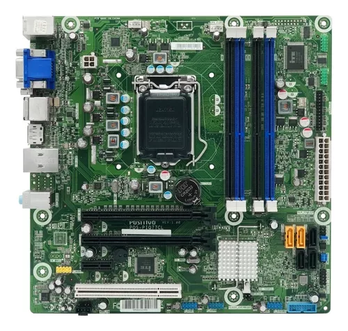
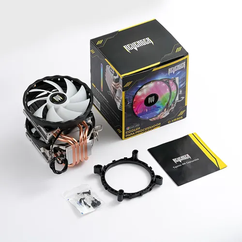

# projetophp
Projeto final disciplina de Desenvolvimento web

                <section>
                    <h2>Placa Mãe</h2>
                    
                    <article>
                        <h3>Placa Mãe Lga 1155 2ª E 3ª Geração Pos-pih77cm Até 32gb</h3>
                    </article>
                </section>
                <section>
                    <h2>Processador</h2>
                    
                    <article>
                        <h3>Processador Intel Xeon E5506 2.13ghz 4 Núcleos 4mb Cache Lga-1366</h3>
                    </article>
                </section>
                <section>
                    <h2>Cooler</h2>
                    
                    <article>
                        <h3>Cooler Cpu Led Ryzen Intel Xeon 1356 2011 1150 1151 1155 Am4</h3>
                    </article>
                </section>
                 <section>
                    <h2>Cooler</h2>
                    
                    <article>
                        <h3>Cooler Cpu Led Ryzen Intel Xeon 1356 2011 1150 1151 1155 Am4</h3>
                    </article>
                </section>
                
            

CREATE DATABASE drtec CHARACTER SET utf8mb4 COLLATE utf8mb4_general_ci;
USE drtec;

CREATE TABLE usuarios (
    id INT AUTO_INCREMENT PRIMARY KEY,
    login VARCHAR(50) NOT NULL,
    senha VARCHAR(50) NOT NULL
);

-- Criar usuário de teste
INSERT INTO usuarios (usuario, senha) VALUES ('admin', '1234');

CREATE TABLE produtos (
    id INT AUTO_INCREMENT PRIMARY KEY,
    nome VARCHAR(100) NOT NULL,
    preco DECIMAL(10,2) NOT NULL,
    imagem VARCHAR(255) NOT NULL
);

-- Criar produto de teste
INSERT INTO produtos (nome, preco, imagem) VALUES ('cooler', '100,00', 'imagens/cooler.webp);